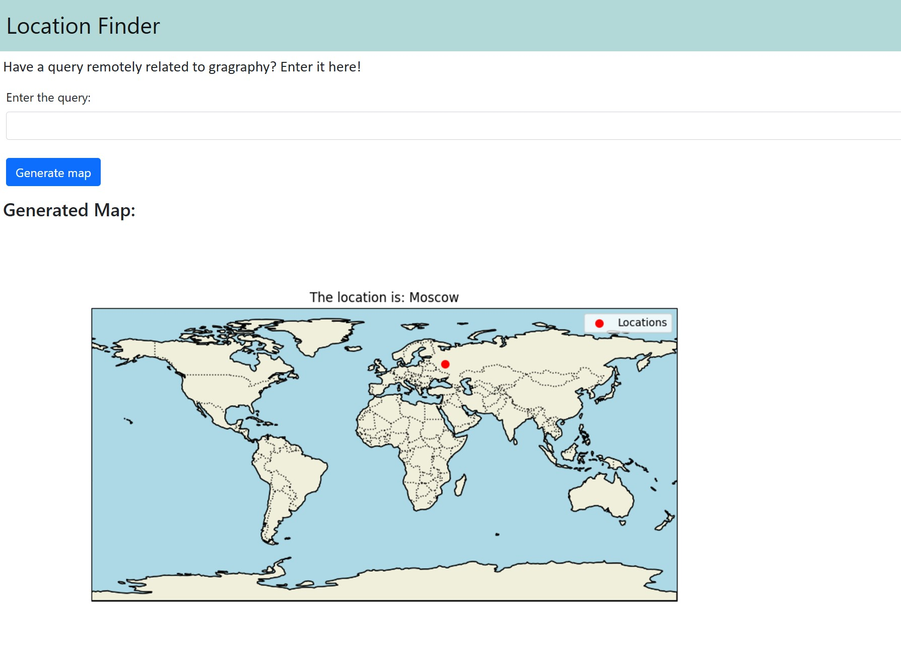

Write a query about a location anywhere in the world and see where it actually is!

This app uses a Flask frontend and utilizes Groq AI to generate the longitude and latitude of the location specified in the query.
This location is then shown on a world map.

* To use this app, run the following:

```
python app.py
```

It requires making a .env file in the main folder directory with a Groq api key defined as:
```
GROQ_API_KEY = <your-key>
```

