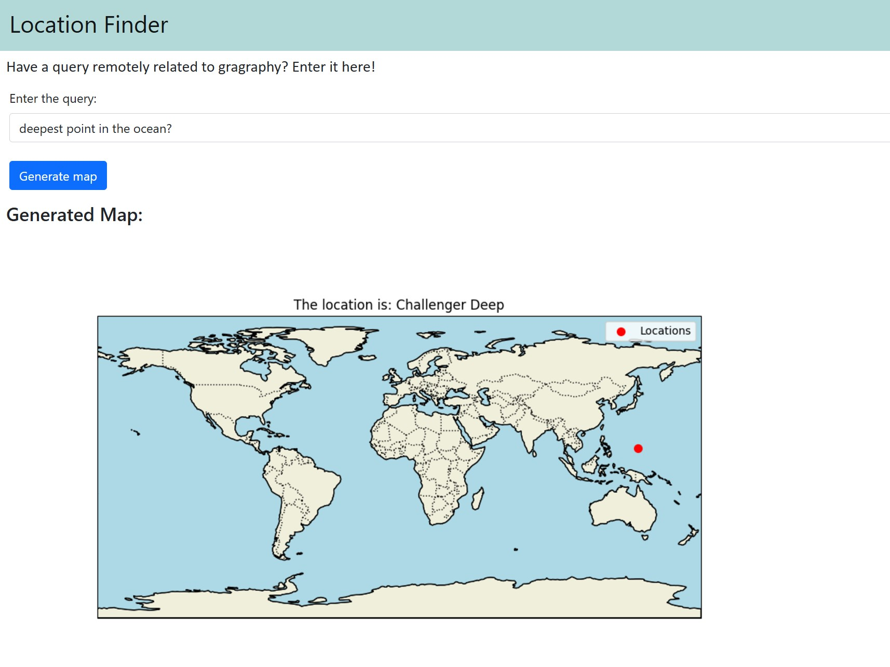

Write a query about a location anywhere in the world and see where it actually is!

This app utilizes the power of LLMs combined with a Flask frontend to understand user query and relate it to a real world geographical locaiton. The app generates the name, longitude and latitude of the location alluded to in the query. This location is then shown on a world map.

* To use this app, run the following:

```
python app.py
```

It requires making a .env file in the main folder directory with a Groq AI api key defined as:
```
GROQ_API_KEY = <your-key>
```

